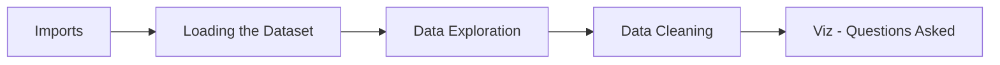

# Fifa18-22-EDA
 For the love of Football!
 

*All it took was a small passion project to rekindle the interest in DS*

## Description
- Downloaded from Kaggle, the Fifa 18 Dataset contains multitude of information about the countless players, along with their attributes related to the position-based and general abilities. 
- General trends throughout the game, as well as transition from Fifa 18 to Fifa 22 have been analysed and inferences have been derived. 
- Self prescribed questions have been asked and answered to understand the data better, while providing insights into the type of game that was played 4 years ago.

## Workflow 

## Questions Asked

**Q1. Overall vs ....**

What makes a good player? This has been the question asked and answered by almost every football fan, and this time let's make the data answer it. Trends in overall vs other attributes have been analysed to answer those questions.

**Q2. Roles vs Attributes**

Feature Engineering has been performed to categorise players by their positional roles - Attacker / Midfielder / Defender / Goalkeeper and then grouped and compared to the attribures related to their positions. 

**Q3. That player is so great in his position!**

What makes a player great in the position he plays? What gives an edge to an attacker/midfielder/defender/goalkeeper to become the best he/she can be?

**Q4. Trend changes from Fifa 18 to 22**

The games are set to reflect the way of football that's being played in the respective years. Possession based attacking football is the name of the game and the analysis done reflects the ideas leaning towards that philosophy and better overal ratings given to players that have specific attributes matching those ideals. 

